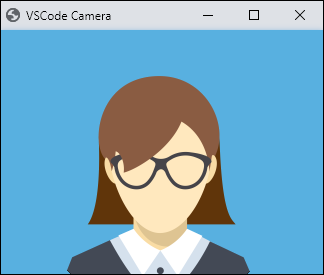

# vscode-camera

CAUTION: Attempts to turn on camera.

Launches desktop Chrome with a webcam feed showing in &lt;video/> tag.

This can be useful when recording screencasts.

## How it works?

The ```Camera``` command launches desktop Chrome using ```chrome-launcher``` npm package in ```app``` mode

```
chrome_launcher.launch({
    chromeFlags: [
        `--app=file:///${path.join(context.extensionPath, 'camera', 'camera.html').replace('\\', '/')}`
    ]
});
```

with HTML:

```
<!DOCTYPE html>
<html lang="en">
  <head>
    <meta charset="UTF-8" />
    <meta name="viewport" content="width=device-width, initial-scale=1.0" />
    <title>VSCode Camera</title>
    <style>
      * {
        margin: 0;
        padding: 0;
      }
      html,body,video {
        width: 100vw;
        height: 100vh;
      }
    </style>
  </head>
  <body>
    <video id="selfie" autoplay playsinline></video>
    <script>
      window.resizeTo(338,282);
      const videoElement = document.getElementById("selfie");
      navigator.mediaDevices
        .getUserMedia({
          video: {
            facingMode: "user",
          },
        })
        .then((stream) => {
          videoElement.srcObject = stream;
        });
    </script>
  </body>
</html>
```
## How to use?

Invoke command palette and then type ```Camera``` command.

It will show a Chrome window with camera feed.



## Programmatic use

```
    vscode.commands.executeCommand('vscode-camera');
```
